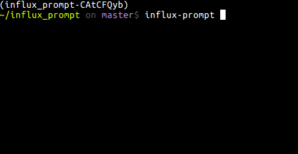

influx-prompt
===============================

Overview
--------

An interactive command-line InfluxDB cli.

Inspired by [pgcli](https://github.com/dbcli/pgcli), [http-prompt
](https://github.com/eliangcs/http-prompt)

Requirement
--------
Python 3.6+, *nix system.

It hasn't tested on Windows.

Installation
--------------------

To install use pip:

    $ pip install influx-prompt

Or clone the repo:

    $ git clone https://github.com/RPing/influx-prompt.git
    $ python setup.py install

Usage
------------
influx-prompt `-h` / `--help` to list all options.

Ctrl+d / `exit` to exit.

Dead simple.

Contributing
------------

1. Fork to your repo
2. install `pipenv`
3. `pipenv shell`
4. `pipenv install --dev`
5. Finish your work, and use `tox` & `flake8` to test.
6. Pull requests!

Author
------------

A man who can't live without autocomplete, [Stephen Chen](https://github.com/RPing)

Related Projects
------------
- [pgcli](https://github.com/dbcli/pgcli)
- [mycli](https://github.com/dbcli/mycli)

Thanks
------------
[python-prompt-toolkit](https://github.com/jonathanslenders/python-prompt-toolkit), and of course, [InfluxDB](https://www.influxdata.com).

License
------------

MIT
